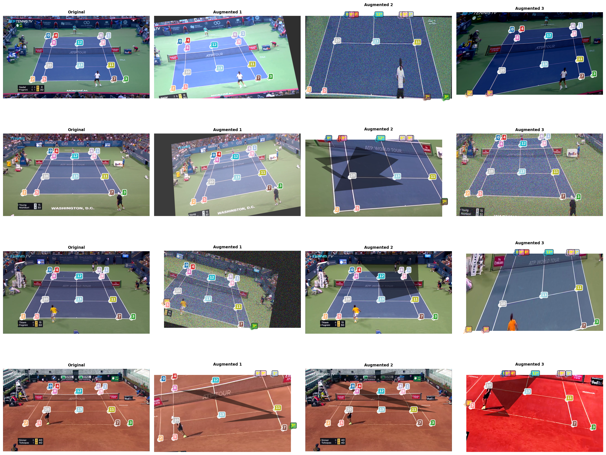
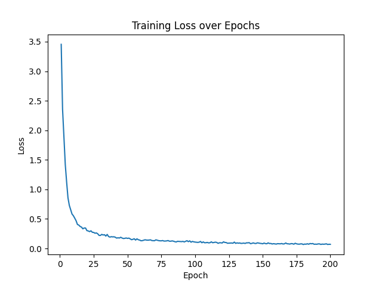
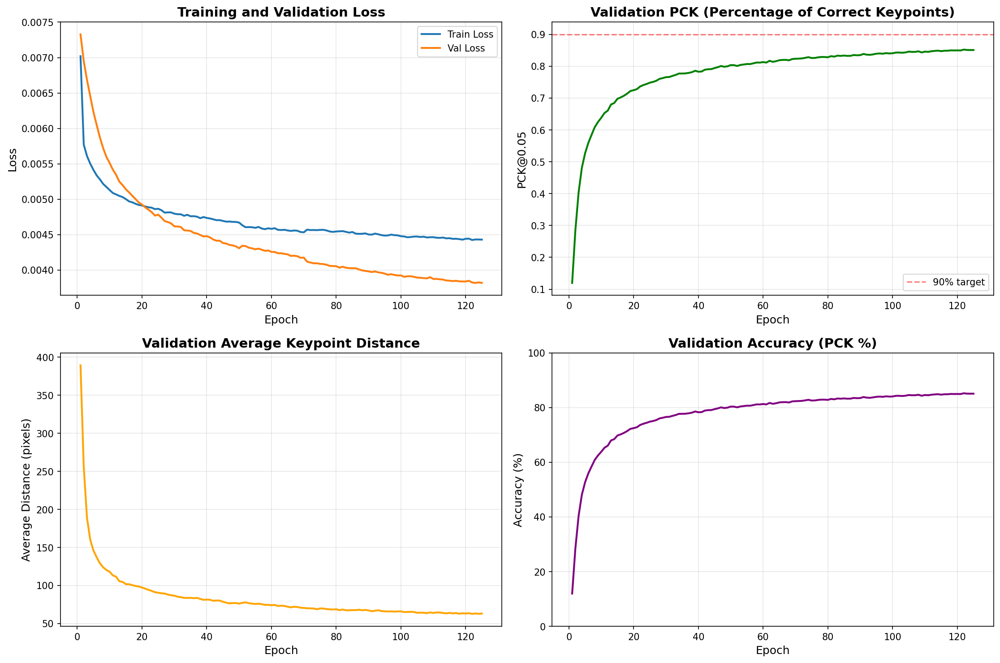
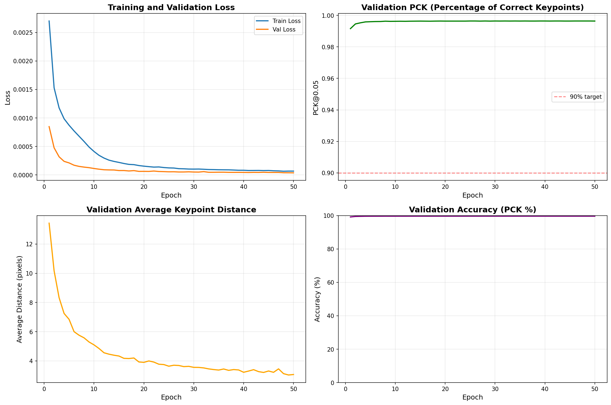
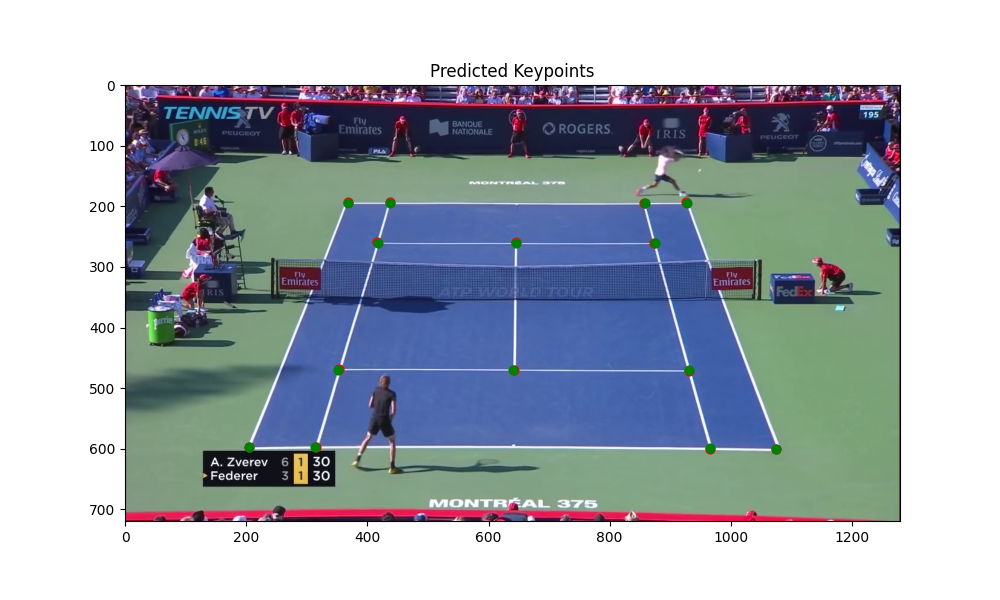

# CourtIQ

AI Tennis Tracking System

# Implementation

 - Used pretrained MobileViT model as backbone via timm
 - Fine-tuned the backbone to tennis courts using contrastive learning (SimCLR)
 - Train multiple heads. One head each for keypoints, the ball, and the players.

# Dataset Augmentation
The first iteration was overfit on the camera angle of the original dataset. The keypoint head and fine-tuning were retrained using the augmented dataset in hopes of simulating different camera angles.   
Examples of data augmentation:  

# Training
Fine-tuning backbone using SimCLR and NT-Xent Loss:   

Training custom keypoint head (backbone frozen):  

Fine-tuning the custom keypoint head and backbone:  

Inference on Image (green is truth, red is prediction):  

# Upcoming Features:
 - Court overlay
 - Live player movement and ball tracking on overlay
 - Show shot and ball speed (e.g. topspin, 60 mph)
 - Line calls
 - Highlight generation (cuts out time between points)
 - Statistics (winners, unforced errors, serve percentage, average ball speed, distance traveled, etc)

## Remember to do:
 - pull from virtual repo
 - activate venv (venv\Scripts\activate)
 - pip install -r requirements.txt
 - do any implementation
 - commit and push
 - deactivate venv (deactivate)

